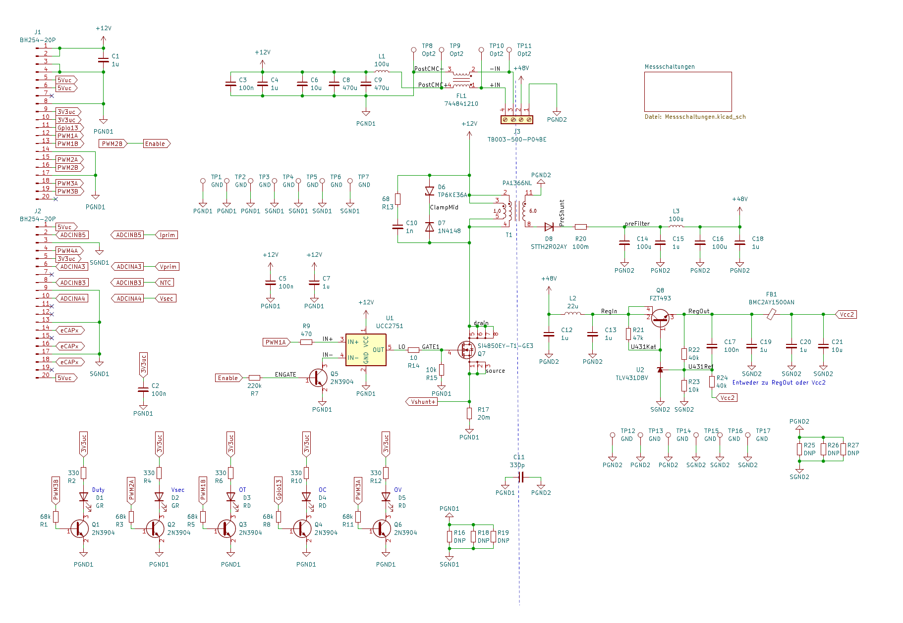
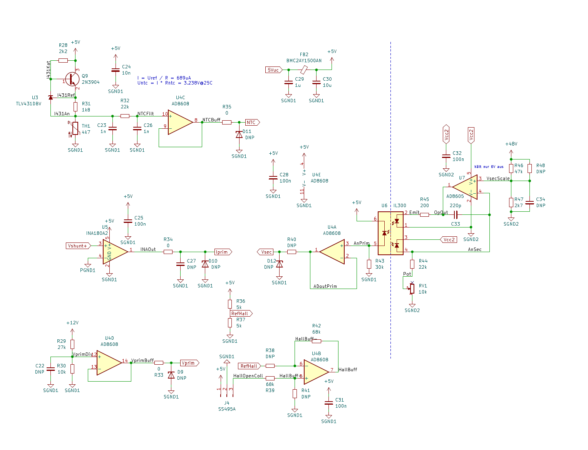
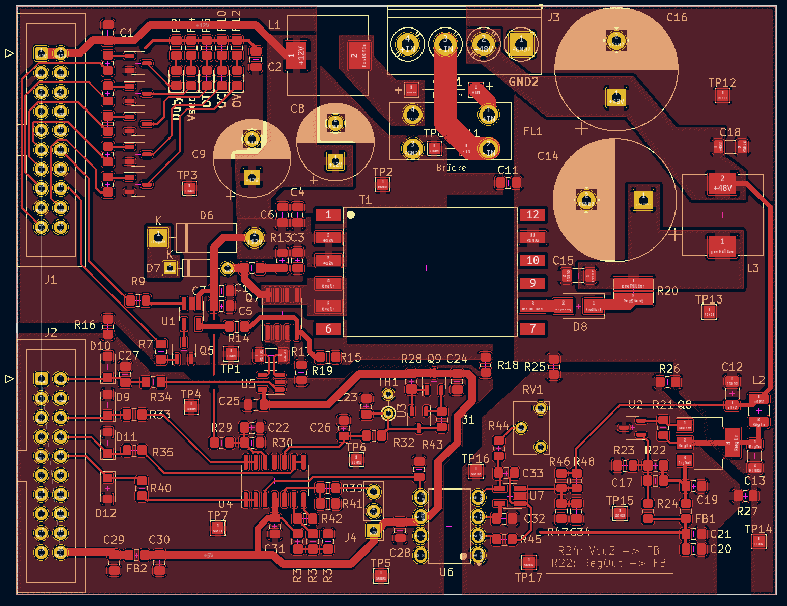
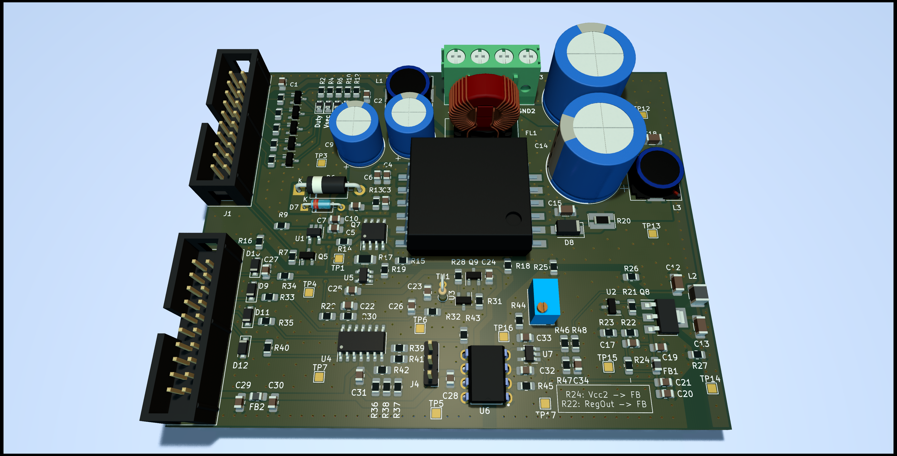
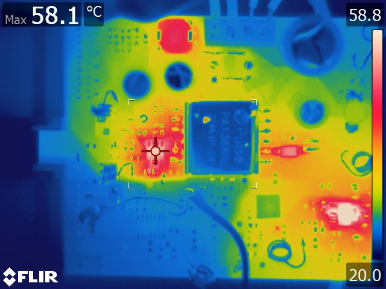

# Flyback

Hierbei handelt es sich um einen Flyback-Wandler von ~10V auf 48V mit etwa 25W Ausgangsleistung. Die Steuerung übernimmt ein TMS320F28069 (Teil eines Entwicklerkits), der Daten mittels Bluetooth-Modul (auf einer selbstgebauten Adapterplatine) an ein Mobilgerät überträgt und auch von diesem gesteuert werden kann.

## Quellcode

Der Quellcode referenziert hardwareabhängige Funktionen und Definitionen der F2806-Familie, die von TI bereitgestellt werden und hier nicht mit aufgeführt sind. Das UI auf Bedienerseite wurde auf einem IPad mit der Software Pythonista in Python geschrieben. Der zugehörige Code ist hier ebenfalls nicht enthalten.

## Schaltplan

Die Schaltung beinhaltet lediglich leistungselektronische Elemente sowie analoge Messtechnik. Diese werden über Steckverbinder an eine Adapterplatine übergeben, die die Schnittstelle zu einem TI Launchboard bildet. Dieses bildet auch das PWM-Signal für den Haupt-MOSFET Q7 sowie Signale für Visualisierungs-LEDs.

### Hauptseite

### Messschaltungen

## Layout Top

## 3D

## IR

